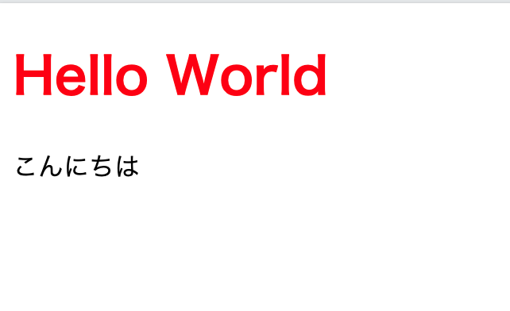

# Web フロントエンドって？

---

## どんな領域の開発？

- ユーザーが Web ブラウザを通じて閲覧する Web サイトの開発
  - HTML を書いてページの構造を組み立てたり
  - CSS で HTML に style をつけたり
  - JavaScript でユーザーの処理に対応したロジックを実装したり
    - API サーバーからデータを取得して表示したり
    - ボタンを押したときにモーダルを表示したり
    - ログインの状態を管理したり

---

## HTML

<!-- block-start: grid -->
<!-- block-start: column -->

```html
<!DOCTYPE html>
<html>
  <body>
    <h1>Hello World</h1>
  </body>
</html>
```


<!-- block-end -->
<!-- block-start: column, left -->

> HTML (HyperText Markup Language) はウェブのもっとも基本的な構成要素です。 HTML はウェブページの基本レイアウトに従ってウェブページのコンテンツを記述し定義するものです。

[MDN/HTML](https://developer.mozilla.org/ja/docs/Web/HTML)

<!-- block-end -->
<!-- block-end -->

---

## CSS

<!-- block-start: grid -->
<!-- block-start: column -->

```CSS
h1 {
  color: red;
}
```



<!-- block-end -->
<!-- block-start: column, left -->

> カスケーディングスタイルシート Cascading Style Sheets (CSS) はスタイルシート言語であり、HTML や XML (方言である SVG、MathML、XHTML などを含む) で記述された文書の体裁や見栄えを表現するために用いられます。 CSS は、要素が画面上で (あるいは紙や音声といった別のメディア上で) どのように表現されるのかを定義します。

[MDN/CSS](https://developer.mozilla.org/ja/docs/Web/CSS)

<!-- block-end -->
<!-- block-end -->

---

## JavaScript

<!-- block-start: grid -->
<!-- block-start: column -->

```javascript
const word = 'Hello World';

const greet = () => {
  console.log(word);
};

greet();
```

<!-- block-end -->
<!-- block-start: column, left -->

> JavaScript (JS) は軽量で、インタープリター型、あるいは実行時コンパイルされる、第一級関数を備えたプログラミング言語です。ウェブページでよく使用されるスクリプト言語として知られ、多くの非ブラウザー環境、例えば Node.js や Apache CouchDB や Adobe Acrobat などでも使用されています。 JavaScript はプロトタイプベースで、シングルスレッドで、動的型付けを持ち、そしてオブジェクト指向、命令型、宣言型 (関数プログラミングなど) といったスタイルをサポートするマルチパラダイムのスクリプト言語です。詳しくは JavaScript についてをお読みください。

[MDN/JavaScript](https://developer.mozilla.org/ja/docs/Web/JavaScript)

<!-- block-end -->
<!-- block-end -->
