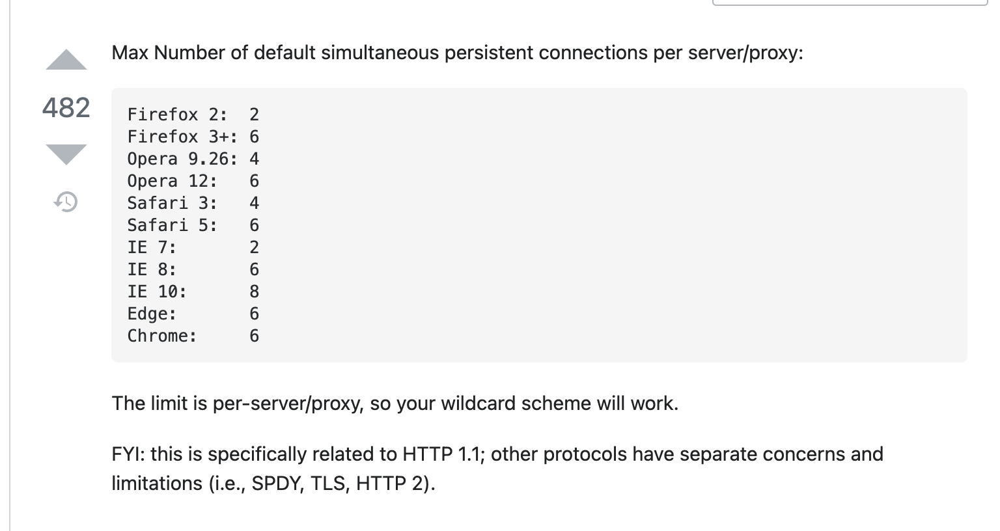

# JavaScript の module の変遷

---

## そもそも module とは

- 特定の責務を持ったコードのまとまり
- 複数箇所で再利用できる
- 例: 数字を 3 桁区切りで`,`を挿入する module
  - 数字を表示する必要のある箇所でこの module を再利用できる

---

## 最初期

<!-- block-start: grid -->
<!-- block-start: column -->

```html
<!DOCTYPE html>
<html>
  <body>
    <script type="text/javascript" src="./a.js"></script>
    <script type="text/javascript" src="./b.js"></script>
    <script type="text/javascript" src="./c.js"></script>
    <script type="text/javascript" src="./d.js"></script>
    <script type="text/javascript" src="./e.js"></script>
    <script type="text/javascript" src="./f.js"></script>
    <script type="text/javascript" src="./g.js"></script>
    <script type="text/javascript" src="./h.js"></script>
    <script type="text/javascript" src="./i.js"></script>
    <script type="text/javascript" src="./j.js"></script>
  </body>
</html>
```

<!-- block-end -->
<!-- block-start: column, left -->

- JavaScript は HTML / CSS に少しだけ動きを足すような使われ方
  - ソースコードが巨大化することはなく、module の仕組みは必要ない想定
- script tag を HTML にたくさん書いて大量の JS を読み込んでいた

<!-- block-end -->
<!-- block-end -->

---

## 最初期

<!-- block-start: grid -->
<!-- block-start: column -->



https://stackoverflow.com/questions/985431/max-parallel-http-connections-in-a-browser

<!-- block-end -->
<!-- block-start: column, left -->

- 問題:

  - プロトコル(HTTP1.1)上の、1 度に読み込めるファイルの数の限界
  - 全て同じ名前空間
    - a.js と b.js に同じ名前の変数定義があると読み込む順番によって上書きされてしまう
    - ファイル間の依存関係順にスクリプトタグを記述しないといけない

<!-- block-end -->
<!-- block-end -->

module と呼ぶには再利用性が低い :sob:

---

## IIFE パターン

<!-- block-start: grid -->
<!-- block-start: column -->

```javascript
// グローバルスコープ
var scope = {};

(function () {
  var aName = 'Barry';
  scope.aName = 'Barry';
})();

// 関数の外から内部で定義された変数にアクセスできない
aName;

// スコープ経由でならアクセスできる
scope.aName;
```

<!-- block-end -->
<!-- block-start: column, left -->

- 関数の中は scope がある
  - 擬似的に private な空間として利用
- 名前が衝突するのを防げる

<!-- block-end -->
<!-- block-end -->

---

## IIFE パターン

<!-- block-start: grid -->
<!-- block-start: column -->

```javascript
// グローバルスコープ
var scope = {};

(function () {
  var aName = 'Barry';
  scope.aName = 'Barry';
})();

// 関数の外から内部で定義された変数にアクセスできない
aName;

// スコープ経由でならアクセスできる
scope.aName;
```

<!-- block-end -->
<!-- block-start: column, left -->

- 問題:
  - dead code の検出はできない
  - 依存関係解決の問題は残る
  - 結局グローバル変数の問題は残る

<!-- block-end -->
<!-- block-end -->

---

## Node.js の誕生

<!-- block-start: grid -->
<!-- block-start: column -->


```javascript
// hello.js
// 他のファイルから利用したいmodule をexport する
module.exports = function hello() {
  return 'hello';
};

// main.js
// export されたmodule をimport して使う
var hello = require(‘./hello’);
```

<!-- block-end -->
<!-- block-start: column, left -->

- ブラウザ以外の初の JavaScript の実行環境
- サーバーサイド JavaScript の誕生
- commonJS という require/export を使った module の仕組みを実現
- npm の誕生
  - 誰かの書いたライブラリを再利用できるように

<!-- block-end -->
<!-- block-end -->

---

## Node.js の誕生

<!-- block-start: grid -->
<!-- block-start: column -->


```javascript
// hello.js
// 他のファイルから利用したいmodule をexport する
module.exports = function hello() {
  return 'hello';
};

// main.js
// export されたmodule をimport して使う
var hello = require(‘./hello’);
```

<!-- block-end -->
<!-- block-start: column, left -->

- 問題:
  - require/export は Node.js の文法なので、ブラウザの JavaScript では動かない :sob:

<!-- block-end -->
<!-- block-end -->

---

## Bundler の登場

<!-- block-start: grid -->
<!-- block-start: column -->

<!-- block-end -->
<!-- block-start: column, left -->

- Node.js のコードをブラウザで実行可能なものに変換する
- Browserify など

<!-- block-end -->
<!-- block-end -->

---

## Bundler の登場

<!-- block-start: grid -->
<!-- block-start: column -->

<!-- block-end -->
<!-- block-start: column, left -->

- 問題:
  - bundle された file は読み込みに時間のかかる単一な巨大なファイル
  - 少しコードを修正しただけでも、プロジェクト内の全ての JS を bundle し直す必要があった
  - 全ての module が commonJS 形式で書かれていたわけではなかった
    - IIFE
    - AMD 形式
    - 他にも色々

<!-- block-end -->
<!-- block-end -->

---

## ECMAScript 6 Module

<!-- block-start: grid -->
<!-- block-start: column -->

<!-- block-end -->
<!-- block-start: column, left -->

- ECMAScript はブラウザベンダー各社でバラバラだった JavaScript の振る舞い・仕様を標準化するための基本仕様
- ECMAScript 6 (ES6 / ES2015 とも呼ばれる) で現代の JavaScript の基本となる文法の多くの仕様が策定された
- 以降、毎年 ES2016 / ES2017 のような形で、1 年に 1 度仕様の更新を行っている
- ES6 には Module と呼ばれる import / export を使った module の定義が含まれていた
- ついにブラウザで動く module の仕組みが実現

<!-- block-end -->
<!-- block-end -->

---

## ECMAScript 6 Module

<!-- block-start: grid -->
<!-- block-start: column -->

<!-- block-end -->
<!-- block-start: column, left -->

- 問題:
  - 今まで commonJS 形式で実装されてきた Node.js の資産はどうなる？
  - ブラウザで動く import/export の依存解決はとても遅い

<!-- block-end -->
<!-- block-end -->

---

## Webpack の登場

<!-- block-start: grid -->
<!-- block-start: column -->

<!-- block-end -->
<!-- block-start: column, left -->

- どの環境で実行するか、を指定して bundle できる (ブラウザ向けか、commonJS 向けかなど)
- chunk と呼ばれる単位で bundle を分割できるため、script の読み込みにかかる時間を軽減できる
- 例: トップページで使う JS の chunk / マイページで使う JS の chunk
- 画像 / CSS なども module として解決できる
- JavaScript の中で CSS/画像を import して利用
- plugin で挙動を hack できる

<!-- block-end -->
<!-- block-end -->

---

## Webpack の登場

<!-- block-start: grid -->
<!-- block-start: column -->

<!-- block-end -->
<!-- block-start: column, left -->

- 問題:
  - Webpack の config が複雑になりすぎる
  - Webpack 職人、という meme
  - 職人の心のこもった webpack.config.js
  - webpack の config の属人化、そして誰も読めなくなる

<!-- block-end -->
<!-- block-end -->

---

## 最近の bundler 周りの動き

- 複雑な Webpack の config を書かなくとも、zero config で実行環境を作れるようにする動き
  - React.js だと create-react-app / Next.js など
- build の時間を短縮したい
  - :thinking_face: bundler は JavaScript で実装されていなくても良いのでは？
  - rust / go 製の build tool の登場
  - 例: esbuild / swc
