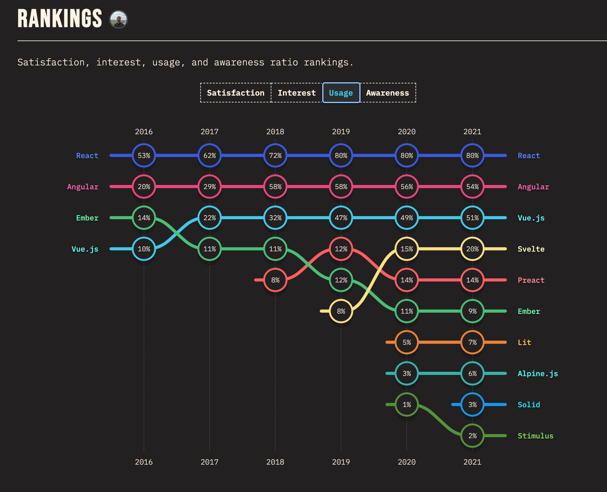

# フロントエンドライブラリの変遷

---

## jQuery の天下

<!-- block-start: grid -->
<!-- block-start: column -->


<!-- block-end -->
<!-- block-start: column, left -->

- jQuery が広く使われていた
- 当時の JavaScript にはない便利な文法があった
- ブラウザ間の JavaScript 実装の差分を jQuery で吸収できた

<!-- block-end -->
<!-- block-end -->

---

## どんどんリッチになる Web フロントエンドの UI

- jQuery で表現するのが辛くなってきた
  - Web フロントエンド専用のライブラリ、というわけではないので、実装の方針・設計などはエンジニアに委ねられる
  - 現場によって実装方針がバラバラ
    - jQuery にオレオレ便利関数を足して使う
    - jQuery のバージョンがまちまち

---

## CSS の再利用性の問題

- CSS の干渉・依存・再利用性
  - JavaScript で起きていたような module の問題
  - セレクターがぶつかってしまう
  - 依存関係・読み込み順
  - :thinking_face: 他の CSS に影響を与えない、特定の scope に閉じた CSS がほしい...
  - :thinking_face: HTML/JavaScript/CSS を意味のあるまとまり毎に定義して、再利用できればよいのに...

---

## React.js (宣言的 UI) の登場

<!-- block-start: grid -->
<!-- block-start: column -->

```jsx
const Button = (props) => {
  const helloWorld = () => {
    console.log(helloWorld);
  };

  return <button>{props.text}</button>;
};
```

https://reactjs.org/

<!-- block-end -->
<!-- block-start: column, left -->

- JavaScript first
  - JSX を返却する JavaScript の class / function
  - 元々は class component しかなかったが、後から function component が実装 && hooks API という function component に logic を書くための API が登場したことにより、現在ではほぼ全ての component を function component に書くようになっている
  - JavaScript のロジックも HTML も同じ.jsx ファイルに書ける

<!-- block-end -->
<!-- block-end -->

---

## React.js (宣言的 UI) の登場

<!-- block-start: grid -->
<!-- block-start: column -->

```jsx
// CSS in JS
const Container = styled("div")`
  display: flex;
  width: 100%;
  height: 100%;
`;

const StyledButton = styled("button")`
  color: red;
  width: 100px;
`;

const App = () => (
  <Container>
    <StyledButton>Helo</StyledButton>
  </Container>
);
```

<!-- block-end -->
<!-- block-start: column, left -->

- CSS は scoped にする
  - 例: CSS module
    - Webpack の設定で CSS を JavaScript から import できるようにする
    - Webpack (正確には Webpack の loader) が build 時に selector を component 内に閉じるような名前に自動変換
    - component の内部にしか影響を与えない CSS 定義ができる
- 例: CSS in JS
  - CSS を JavaScript 内で書いてしまおう、という考え方
  - styled-component / emotion が有名
  - (jQuery のコードを React で書きなおしたものを載せる)

<!-- block-end -->
<!-- block-end -->

---

## 現在の Web フロントエンドライブラリのメタ

<!-- block-start: grid -->
<!-- block-start: column -->


https://2022.stateofjs.com/en-US/libraries/front-end-frameworks/

<!-- block-end -->
<!-- block-start: column, left -->

- React.js が筆頭
- React.js を使う場合は、React.js のフレームワークである Next.js を採用するのがデファクトになりつつある
  - 開発元である Vercel の体制が安泰
    - 大量の資金調達
    - JavaScript / TypeScript の OSS 開発者を採用

<!-- block-end -->
<!-- block-end -->
